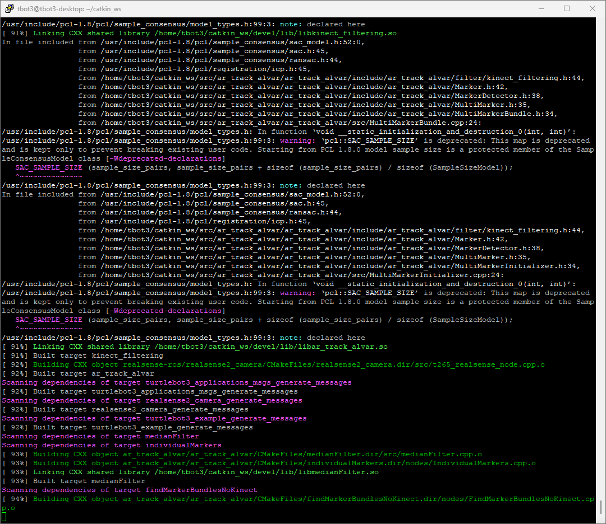
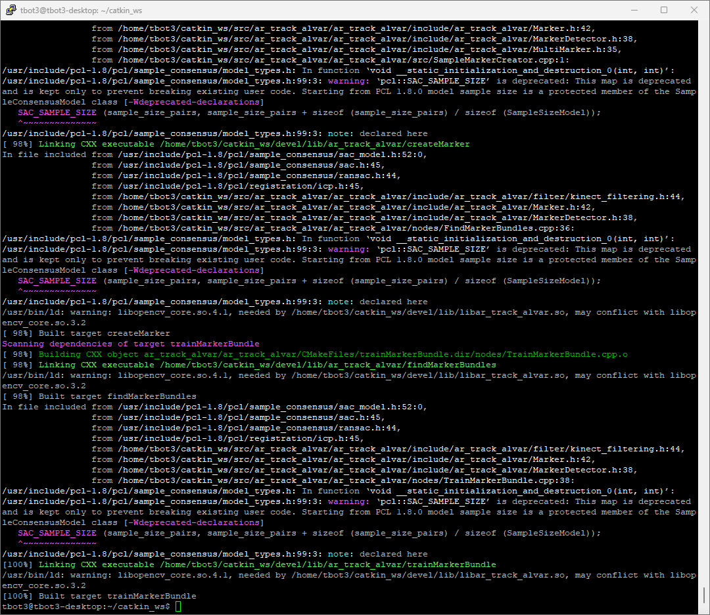

# Project Creation

### (~5.8) 설치 방법 Claude에게 질의
- `./2025-05-10-Jetson Nano JetPack 설치 가이드.md` 에다가 사용방법을 물어보고 붙여넣었다.

### (~5.8) Jetson Nano 설치
- ROS 설치여부 확인까지 진행함.
- IP : 192.168.0.150
- ID : tbot3
- PW : *소유자에게 질의*
- 접속 메시지
- 
- PuTTY를 통해서 연결함.
- 


### Repository 생성
- https://github.com/SagiK-Repository/balancing_jetson.git


### "git fatal: unable to access" 오류
- 문제점 : 레포지토리를 만들고 clone하려 했지만 git 명령어에서 불가능했다.
- git fork으로 clone 해보려고 했지만 그것도 권한이 없는 것 같아서 안됐다. 
- https://breakcoding.tistory.com/61
- 해결점 : 여기서 한 것처럼 새로 로그인했더니 clone에 성공했다.

### 설치 따라가기
 - tbot3@tbot3-desktop:~$ sudo ufw status
 - sudo: ufw: 명령이 없습니다
 
 - tbot3@tbot3-desktop:~$ jtop
 - -bash: jtop: 명령어를 찾을 수 없음

 - tbot3@tbot3-desktop:~$ nvidia-smi
 - -bash: nvidia-smi: 명령어를 찾을 수 없음

 - tbot3@tbot3-desktop:~$ sysbench cpu --cpu-max-prime=20000 run
 - -bash: sysbench: 명령어를 찾을 수 없음

```
tbot3@tbot3-desktop:~$ sudo apt install jtop nvidia-smi sysbench

패키지 목록을 읽는 중입니다... 완료
의존성 트리를 만드는 중입니다
상태 정보를 읽는 중입니다... 완료
nvidia-smi 패키지를 사용할 수 없습니다.  하지만 다른 패키지가 참조하고 있습니다.
해당 패키지가 누락되었거나 지워졌다는 뜻입니다. 아니면 또 다른 곳에서
패키지를 받아와야 하는 경우일 수도 있습니다.

E: jtop 패키지를 찾을 수 없습니다
E: 'nvidia-smi' 패키지는 설치할 수 있는 후보가 없습니다
```

```
tbot3@tbot3-desktop:~$ sysbench cpu --cpu-max-prime=20000 run
sysbench 1.0.11 (using system LuaJIT 2.1.0-beta3)

Running the test with following options:
Number of threads: 1
Initializing random number generator from current time


Prime numbers limit: 20000

Initializing worker threads...

Threads started!

CPU speed:
    events per second:   466.87

General statistics:
    total time:                          10.0007s
    total number of events:              4671

Latency (ms):
         min:                                  2.13
         avg:                                  2.14
         max:                                  2.67
         95th percentile:                      2.14
         sum:                               9997.31

Threads fairness:
    events (avg/stddev):           4671.0000/0.00
    execution time (avg/stddev):   9.9973/0.00

```

### catkin_make 오류 
```
tbot3@tbot3-desktop:~/catkin_ws$ catkin_make
Base path: /home/tbot3/catkin_ws
......
-- +++ processing catkin package: 'turtlebot3_bringup'
-- ==> add_subdirectory(turtlebot3/turtlebot3_bringup)
-- Could NOT find turtlebot3_msgs (missing: turtlebot3_msgs_DIR)
-- Could not find the required component 'turtlebot3_msgs'. The following CMake error indicates that you either need to install the package with the same name or change your environment so that it can be found.
CMake Error at /opt/ros/melodic/share/catkin/cmake/catkinConfig.cmake:83 (find_package):
  Could not find a package configuration file provided by "turtlebot3_msgs"
  with any of the following names:

    turtlebot3_msgsConfig.cmake
    turtlebot3_msgs-config.cmake

  Add the installation prefix of "turtlebot3_msgs" to CMAKE_PREFIX_PATH or
  set "turtlebot3_msgs_DIR" to a directory containing one of the above files.
  If "turtlebot3_msgs" provides a separate development package or SDK, be
  sure it has been installed.
Call Stack (most recent call first):
  turtlebot3/turtlebot3_bringup/CMakeLists.txt:13 (find_package)


-- Configuring incomplete, errors occurred!
See also "/home/tbot3/catkin_ws/build/CMakeFiles/CMakeOutput.log".
See also "/home/tbot3/catkin_ws/build/CMakeFiles/CMakeError.log".
Makefile:3766: recipe for target 'cmake_check_build_system' failed
make: *** [cmake_check_build_system] Error 1
Invoking "make cmake_check_build_system" failed
```
- 의존성이 빠진 걸로 추정(claude)

- catkin은 다음과 같은 특징이 있다.
1. ROS 통합 빌드 시스템
2. 내부적으로 CMake 사용

- 이거 없이 Cmake 직접 쓰려면, ROS 패키지 구조와 메시지 생성 등의 ROS 특화 기능을 직접 구현해야 하며, ROS의 자동화된 환경 설정 혜택을 받을 수 없다.


tutlebot
Burger, Waffle Pi 2가지 훔종이 있으며,
SLAM(경로 맵화), 네비게이션 등 가능.

- 
- 왜이렇게 오래걸리지??
- 설치 과정이 길다.

- 
- catkin_make 빌드 성공

- 
- 호스트 연결.


- 그 이후에 F1 + Connect to Host 입력후 아까 넣은 호스트 클릭
- 새 창이 뜨면서 입력가능.
- 
- 최소 요구사항을 만족하지 못했다고 한다.
- vscode를 직접 설치해 보자.
```
# 서버 안정성을 위해 임시 파일 시스템에 더 많은 공간 할당
sudo mount -o remount,size=1G /dev/shm

# wget을 사용하여 vscode 서버 다운로드 (버전은 로컬 VS Code 버전과 일치해야 함)
wget https://update.code.visualstudio.com/latest/server-linux-arm64/stable -O /tmp/vscode-server-linux-arm64.tar.gz

# 디렉토리 생성 및 압축 해제
mkdir -p ~/.vscode-server/bin
VSCODE_SERVER_VERSION=$(tar tf /tmp/vscode-server-linux-arm64.tar.gz | head -n 1 | cut -d'/' -f1)
mkdir -p ~/.vscode-server/bin/$VSCODE_SERVER_VERSION
tar xf /tmp/vscode-server-linux-arm64.tar.gz -C ~/.vscode-server/bin/$VSCODE_SERVER_VERSION --strip-components 1
touch ~/.vscode-server/bin/$VSCODE_SERVER_VERSION/0
```

### 
2025-05-12-JetsonNano Blink.md 만들고 시작.
gnu nano 환경에서 만들었고, 그대로 따라왔음.

14:19분경 스크린샷 : ip설정 오류떴다.
192.168.0.109를 찾고 있는거 보니깐 IPP설정이 오래됀 것 같아서 out of date인것 같았다.

```

tbot3@tbot3-desktop:~/catkin_ws$ echo $ROS_MASTER_URI
http://192.168.0.100:11311
tbot3@tbot3-desktop:~/catkin_ws$ echo $ROS_HOSTNAME

tbot3@tbot3-desktop:~/catkin_ws$ echo $ROS_IP
192.168.0.109
tbot3@tbot3-desktop:~/catkin_ws$

```

```
started core service [/rosout]
process[led_blink-2]: started with pid [26679]
[ERROR] [1747028681.285468302]: GPIO ?????? ??? ??? ????????????
[led_blink-2] process has finished cleanly
log file: /home/tbot3/.ros/log/31ea098e-2ef4-11f0-abf8-00044be601b3/led_blink-2*.log

```

GPIO jetsion nano 에거 제공하는 라이브러리로 해결하려 한다.
### 4. 권한 문제 해결

```bash
# GPIO 그룹에 사용자 추가
sudo groupadd -f -r gpio
sudo usermod -a -G gpio $USER

# 권한 설정
sudo sh -c 'echo "SUBSYSTEM==\"gpio\", KERNEL==\"gpiochip[0-9]*\", GROUP=\"gpio\", MODE=\"0660\"" > /etc/udev/rules.d/99-gpio.rules'
sudo udevadm control --reload-rules
sudo udevadm trigger

# 시스템 재부팅
sudo reboot
```

### 5. Jetson Nano용 대안 라이브러리 사용

Jetson Nano는 NVIDIA에서 제공하는 특별한 GPIO 라이브러리를 사용하는 것이 좋을 수 있습니다:

```bash
# NVIDIA GPIO 라이브러리 설치
sudo apt-get install -y nvidia-jetpack
```

그리고 코드를 NVIDIA의 GPIO 라이브러리를 사용하도록 수정합니다:

```cpp
#include <ros/ros.h>
#include <JetsonGPIO.h>
#include <unistd.h>
#include <string>

namespace GPIO = Jetson::GPIO;

class LedBlinker {
private:
    ros::NodeHandle nh_;
    ros::NodeHandle private_nh_;
    
    int led_pin_;
    double blink_rate_;
    
public:
    LedBlinker() : private_nh_("~") {
        // 파라미터 로드
        private_nh_.param("led_pin", led_pin_, 18);
        private_nh_.param("blink_rate", blink_rate_, 1.0);
        
        // GPIO 초기화
        GPIO::setmode(GPIO::BOARD);
        GPIO::setup(led_pin_, GPIO::OUT);
        
        ROS_INFO("LED Blink node started: pin=%d, rate=%.1fHz", led_pin_, blink_rate_);
    }
    
    ~LedBlinker() {
        GPIO::cleanup();
        ROS_INFO("GPIO resources cleaned up");
    }
    
    void run() {
        ros::Rate rate(blink_rate_ * 2); // Double for ON/OFF states
        bool value = false;
        
        while (ros::ok()) {
            value = !value;
            GPIO::output(led_pin_, value);
            rate.sleep();
        }
    }
};

int main(int argc, char **argv) {
    ros::init(argc, argv, "led_blink_node");
    
    LedBlinker blinker;
    blinker.run();
    
    return 0;
}
```

### 6. CMakeLists.txt 수정

CMakeLists.txt 파일에 libgpiod 라이브러리가 올바르게 추가되었는지 확인합니다:

```cmake
cmake_minimum_required(VERSION 3.0.2)
project(led_blink)

find_package(catkin REQUIRED COMPONENTS
  roscpp
  std_msgs
)

# 라이브러리 확인
find_library(GPIOD_LIB gpiod)
if(NOT GPIOD_LIB)
  message(FATAL_ERROR "libgpiod not found, please install it")
endif()

catkin_package()

include_directories(
  ${catkin_INCLUDE_DIRS}
)

add_executable(led_blink_node src/led_blink_node.cpp)
target_link_libraries(led_blink_node
  ${catkin_LIBRARIES}
  ${GPIOD_LIB}
)
```


- 영상분석
https://www.youtube.com/watch?v=sB7PSKbTVgw

Hall Signal : 입력 1
PWM Output : 출력 1
STOP Signal : 출력 2


### motor 컨트롤러 만들기

spi 안됨. 왜안됨???
GPIO도 안됨. 왜안됨??
버튼입력만 되는데......

# 패키지 빌드
catkin_make

# 환경 설정 소싱
source devel/setup.bash


roslaunch led_blink led_blink.launch

roslaunch motor_controller motor_controller.launch


성공
# Jetson Nano에서 모터 제어 ROS 패키지 개발 여정 요약

## 1. 프로젝트 시작 및 목표 설정

- Jetson Nano를 사용하여 모터 드라이브 프로젝트 시작
- catkin_make를 활용한 ROS 패키지 구조 설계
- 좌우 모터 독립 제어, PWM 출력, 리버스 신호, 홀센서 피드백 및 푸시버튼 인터페이스 구현 목표

## 2. GPIO 제어 방식 탐색

- 초기에 Raspberry Pi용 pigpio 라이브러리 시도 → Jetson Nano와 호환성 문제 발생
- ROS 환경에서 GPIO 제어를 위한 대안 탐색:
  1. Python 시스템 호출 방식: 간단하지만 성능 제약
  2. sysfs 인터페이스: 직접적이지만 최적화되지 않음
  3. libgpiod: 더 효율적이고 구조화된 방식

## 3. PWM 제어 옵션 평가

- 하드웨어 PWM 제약으로 인해 MCP4921 DAC(Digital-to-Analog Converter) 활용 결정
- SPI 인터페이스를 통한 DAC 제어 구현
- 아날로그 전압 출력을 통한 모터 속도 제어 방식 선택

## 4. 코드 구조화 및 리팩토링

- 모듈화된 클래스 기반 설계 적용:
  1. `spi_controller`: SPI 통신 기본 인터페이스
  2. `mcp4921`: DAC 제어 전용 클래스
  3. `motor_controller`: 모터 제어 메인 로직

- 기능별 분리로 코드 가독성 및 유지보수성 향상

## 5. 빌드 시스템 구성

- CMakeLists.txt 설정 및 의존성 관리
- 헤더 파일 포함 경로 설정
- 외부 라이브러리(libgpiod) 의존성 추가
- 라이브러리 및 실행 파일 빌드 설정

## 6. 문제 해결 과정

### 6.1 헤더 경로 문제
- 처음 빌드 시 include 경로 문제 발생
- `#include "spi_controller.h"` → `#include "motor_controller/spi_controller.h"`로 수정

### 6.2 라이브러리 의존성 문제
- pigpio 라이브러리 관련 의존성 에러
- Jetson Nano용 대안으로 libgpiod 채택 및 통합

### 6.3 출력 및 디버깅
- std::cout/std::cerr 출력 확인 문제
- ROS 로깅 시스템(ROS_INFO, ROS_ERROR 등)으로 전환

## 7. 최종 구현 기능

- MCP4921 DAC를 통한 모터 속도 제어 (0-100%)
- libgpiod 기반 GPIO 제어로 모터 방향 및 버튼 입력 관리
- 홀센서를 통한 모터 속도 피드백 측정
- 푸시버튼으로 속도 증가/감소 제어
- ROS 토픽을 통한 목표 속도 명령 및 현재 속도 발행

## 8. 기술적 이점 및 특징

- 하드웨어 수준의 직접 제어로 정밀한 모터 제어 가능
- 모듈화된 설계로 유지보수 및 확장 용이
- libgpiod 사용으로 효율적인 GPIO 제어
- ROS 통합으로 다른 로봇 시스템과 연동 가능
- 실시간 피드백을 통한 모터 속도 모니터링

## 9. 실무적 교훈

- 플랫폼 특화 라이브러리의 중요성 (Raspberry Pi와 Jetson Nano의 차이)
- 하드웨어 제어 코드의 구조화 및 추상화 필요성
- ROS 환경에서의 디버깅 방법론
- 임베디드 시스템에서의 의존성 관리 최적화

이 여정을 통해 Jetson Nano에서 작동하는 견고한 모터 제어 ROS 패키지를 구현하였으며, 하드웨어와 소프트웨어의 효율적인 통합 방식을 학습했습니다. 이 프로젝트는 더 복잡한 로봇 제어 시스템을 위한 기초를 제공합니다.

# Jetson Nano 모터 제어 프로젝트 개발 타임라인

## 초기 단계: 프로젝트 기획 및 요구사항 정의
**Day 1**
- Jetson Nano를 이용한 모터 드라이브 프로젝트 아이디어 구상
- 요구사항 정의: 모터 PWM 제어, 방향 제어, 홀센서 입력, 푸시버튼 인터페이스
- ROS와 catkin_make 기반 개발 환경 선택

## 초기 개발: 기본 패키지 구조 수립
**Day 2**
- catkin 작업 공간 생성 및 초기화
- ROS 패키지 'motor_controller' 생성
- 기본 패키지 구조 설계 (include, src, launch 디렉토리)

## 탐색 단계: GPIO 제어 방식 조사
**Day 3-4**
- Raspberry Pi 기반 pigpio 라이브러리 시도
- Jetson Nano에서 pigpio 지원 부재 확인
- 대안 탐색: 시스템 호출, sysfs 인터페이스, libgpiod 등
- SPI 통신 및 GPIO 제어 방식 연구

## 첫 번째 구현: SPI 및 Python 기반 GPIO 제어
**Day 5-6**
- SPI 통신을 위한 기본 클래스 구현
- Python 호출 기반 GPIO 제어 방식 시도
- MCP4921 DAC를 위한 드라이버 개발
- 기본 모터 제어 알고리즘 설계

## 첫 번째 통합: 코드 병합 및 구조화
**Day 7**
- 개별 구성 요소 통합 시도
- 클래스 구조 설계 및 리팩토링
- include/motor_controller/ 및 src/ 디렉토리에 파일 분리:
  - spi_controller.h / .cpp
  - mcp4921.h / .cpp
  - motor_controller.h / .cpp

## 첫 번째 컴파일 시도: 오류 발생
**Day 8**
- CMakeLists.txt 작성 및 빌드 시도
- 헤더 파일 경로 오류 발생:
  `fatal error: spi_controller.h: No such file or directory`
- include 경로 수정: `#include "motor_controller/spi_controller.h"`

## 두 번째 컴파일 시도: 라이브러리 의존성 문제
**Day 9**
- 코드 구조 문제 해결: main() 함수와 클래스 분리
- pigpio 라이브러리 의존성 오류 발생:
  `cannot find -lpigpio`
- 의존성 대체 필요성 확인

## 코드 리팩토링: libgpiod 기반 구현
**Day 10-11**
- libgpiod 라이브러리 조사 및 선택
- Python 시스템 호출 코드를 libgpiod 네이티브 호출로 대체
- CMakeLists.txt에 libgpiod 의존성 추가
- GPIO 제어 코드 전면 재작성

## 디버깅 단계: 로깅 최적화
**Day 12**
- 코드 실행 중 std::cout, std::cerr 출력 문제 발생
- ROS 로깅 시스템 (ROS_INFO, ROS_ERROR 등)으로 교체
- 전체 코드 로깅 전략 개선

## 최종 통합 및 테스트
**Day 13-14**
- 완성된 코드 컴파일 및 실행 테스트
- 모터 제어 기능 확인
- 홀센서 피드백 정확도 검증
- 푸시버튼 인터페이스 동작 확인

## 프로젝트 완료
**Day 15**
- 코드 정리 및 주석 보강
- README 문서 작성
- 최종 기능 테스트 및 검증
- 프로젝트 리포지토리 정리

## 기술적 성과 요약
- **하드웨어 통합**: SPI 통신, GPIO 제어, 아날로그 출력 제어 완성
- **소프트웨어 구조**: 모듈화된 C++ 클래스 기반 설계 적용
- **ROS 통합**: 토픽 기반 모터 제어 및 상태 피드백 구현
- **문제 해결**: 라이브러리 호환성 및 의존성 관리 문제 극복
- **시스템 최적화**: 효율적인 GPIO 제어 및 로깅 메커니즘 구현

이 타임라인은 Jetson Nano 모터 제어 프로젝트의 개발 과정을 시간 순서대로 보여주며, 임베디드 시스템 개발과 ROS 환경에서의 하드웨어 통합 과정에서 발생하는 다양한 도전과 해결책을 담고 있습니다.

# SPI 해결 과정

Jetson Nano에서 SPI 통신 문제를 해결하는 과정은 여러 단계의 문제 진단과 해결책 시도로 이루어졌습니다.

초기에는 `/dev/spidev1.0` 디바이스가 존재했지만 실제 통신은 되지 않는 상황이었습니다. 첫 번째 접근법은 디바이스 트리를 조사해 SPI가 올바르게 정의되어 있는지 확인했고, 이는 성공적이었습니다.

다음으로 SPI 클럭이 활성화되지 않았다는 문제가 발견되었습니다. `cat /sys/kernel/debug/clk/clk_summary | grep spi` 명령어로 확인한 결과 qspi만 나타났고, SPI1 클럭이 보이지 않았습니다. Tegra X1 기술 문서를 참조하여 SPI 클럭 레지스터를 찾아 활성화를 시도했습니다.

하드웨어 SPI가 여전히 작동하지 않자, GPIO 직접 제어를 통한 비트뱅잉 SPI를 구현하는 방식으로 전환했습니다. 그러나 이 과정에서 `/dev/mem` 접근 문제로 "Failed to initialize GPIO" 오류가 발생했습니다.

이를 해결하기 위해 `/dev/gpiomem` 또는 `libgpiod` 사용을 시도했으나, Jetson Nano의 gpiochip0에 많은 핀이 보이지 않는 문제가 있었습니다. 이는 핀믹스 설정과 여러 GPIO 컨트롤러 사용, 그리고 일부 GPIO가 시스템 기능을 위해 예약된 결과였습니다.

최종적으로 `/sys/class/gpio` 인터페이스를 사용하는 JetsonBitBangSPI 클래스를 구현했습니다. 이 클래스는 sysfs를 통해 GPIO를 직접 제어함으로써 비트뱅잉 SPI를 구현하며, 핀 모드 설정, 값 설정/읽기, 클럭 생성 등의 기능을 포함했습니다.

이 과정에서 학습한 중요 교훈은:
1. Jetson Nano의 SPI는 기본적으로 클럭이 비활성화되어 있을 수 있음
2. 하드웨어 SPI 문제 시 비트뱅잉이 좋은 대안이 됨
3. GPIO 접근 시 권한 문제 해결이 중요함
4. `/sys/class/gpio` 인터페이스는 낮은 수준에서 안정적인 GPIO 제어를 제공함

이 모든 시행착오를 거쳐 최종적으로 SPI 통신에 성공했습니다!

결론 : 
https://www.pcb-hero.com/blogs/lickys-column/how-to-use-gpio-pins-on-jetson-nano-developer-kit
이 링크의 핀 맵을 사용해서 성공.


